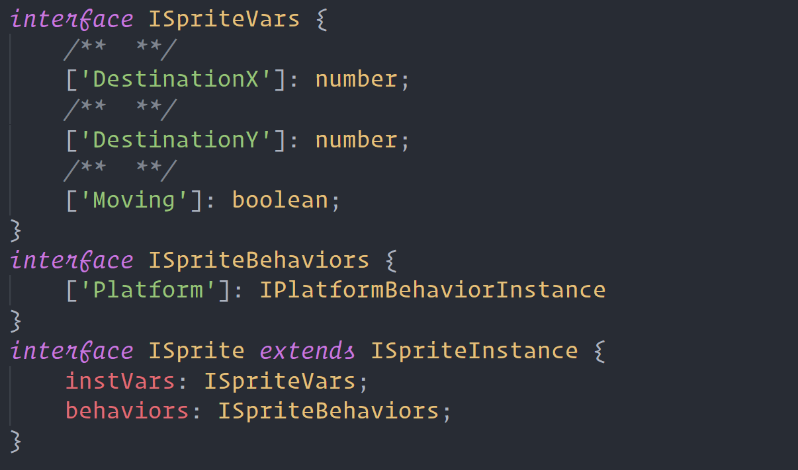
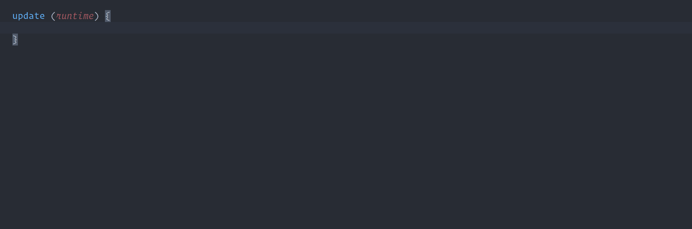
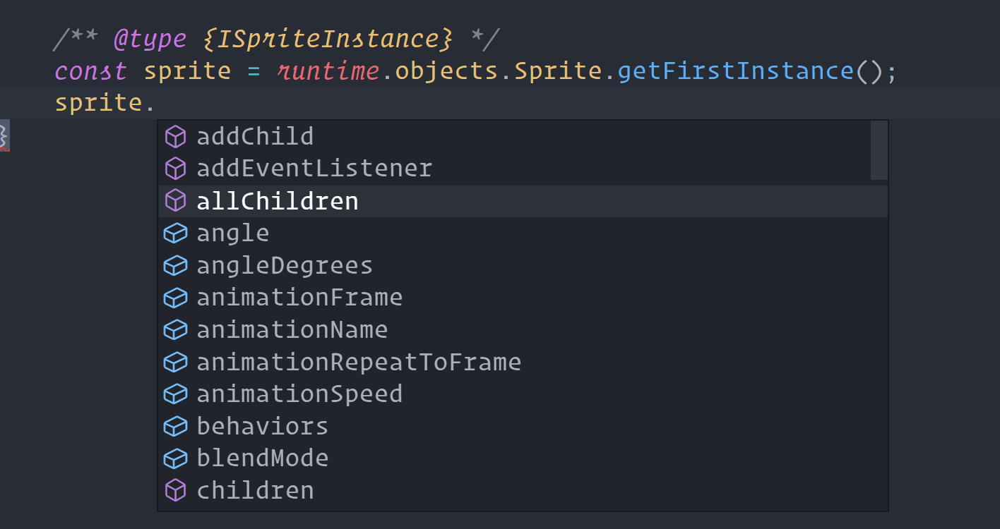

# Construct 3 Tools

This vscode extension is for working on Construct 3 projects locally in 'local folder' mode.

It features:
- Specific typescript definition generation for your project
- Basic code completion for non-typescript projects
- Setup for easy remote debugging (even easier with VS Code Contruct 3 plugin)
- Auto script reloading (with VS Code Construct 3 plugin)

## Features

### Typescript definition generation
Automatically creates a typescript definition file called c3.d.ts in the root of your project with a complete set of unique interfaces for your instances, instance variables, behaviors and global variables. This file also contains complete definitions for all available scipting features in Construct 3.

Generation will happen when you open the project, as well as when you select the Contruct 3 - Regenerate definitions from the command menu.

### Javascript autocomplete
If you are not using Typescript you can still benefit from the definition file autocompletion where appropriate. VS Code will automatically pick up definitions for the runOnStartup method, as well as anything within globalThis.

Where this is not available, autocomplete will try it's best to work out what you're trying to do and provide helpful text suggestions:

For more advanced autocomplete you can also provide hints to vscode about which type a variable is using the jsdoc features by adding a comment above in the format: /** {TYPE} /*

### Remote debugging
This extension will automatically attempt to create a debug profile for you. Once you've set up remote debugging in Chrome  on port 9222.

<i>Add --remote-debugging-port=9222 to the shortcut of your chrome.exe, more info [here](https://developer.mozilla.org/en-US/docs/Tools/Remote_Debugging/Chrome_Desktop).</i>

 when you press F5 it will attach to your running Construct 3 game and allow remote debugging.

If you have the Construct 3 VS Code plugin then running / stopping the debug instance from within VS Code will automatically start / stop your game for you. Note: The construct 3 window requires to be focused / visible periodically, otherwise the game window may not play automatically.

### Auto script reloading
If you have the Construct 3 VS Code plugin then any time you save a file from within VS Code it will reload the script folder inside Construct 3.

## Construct 3 Plugin
For some of these features you will need to install the "VS Code Plugin" addon from the construct website https://www.construct.net/en/make-games/addons/603/vs-code-plugin

## Known Issues

None yet, let me know!

## Release Notes
### 1.0.5
- Updated definitions
### 1.0.4
- Updated definitions
### 1.0.2
- Added extra file required for debugging
### 1.0.1
- Fixing generation issue
- Added logo
### 1.0.0
- Initial release
